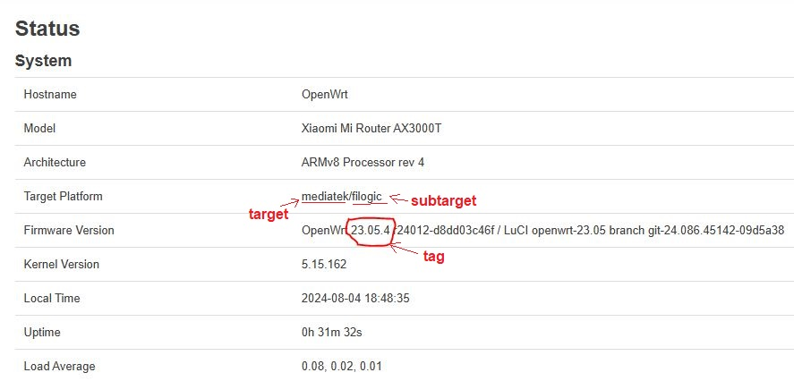
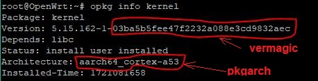

# Сборка пакетов AmneziaWG для OpenWRT
Так как пакетов AmneziaWG до сих пор нет в официальном репозитории OpenWRT, их придется собирать самостоятельно. Процесс несложный и автоматизированный.

### Создаем форк
Создаем форк [репозитория](https://github.com/yury-sannikov/awg-openwrt) с исходными файлами AmneziaWG

### Указываем переменные для сборки
Далее в созданном форке нужно отредактировать в файле `.github/workflows/build-module.yml` переменные для сборки (`build_env`):

1. `tag` - версия OpenWRT
1. `pkgarch` - архитектура пакетов
1. `target` - целевая платформа или серия устройств, для которых будет выполнена сборка
1. `subtarget` - подкатегория целевой платформы
1. `vermagic` - контрольная сумма, которая должна соответствовать определенной версии ядра

Переменные `target`, `subtarget` и `tag` проще всего посмотреть в LuCi: вкладка Status => System => Target Platform. Здесь до слэша указано значение `target`, а после - `subtarget`. Строчкой ниже Firmware Version - версия OpenWRT.



Переменные `pkgarch` и `vermagic` можно получить, подключившись к роутеру по SSH и выполнив команду
```
opkg info kernel
```
 
`pkgarch` - значение поля Architecture, `vermagic` - последняя часть Version


Указываем нужные переменные, сохраняем и коммитим изменения

### Запуск сборки пакетов
Теперь нужно создать релиз, чтобы запустить процесс сборки пакетов. Для этого в нашем форке переходим в Releases и кликаем кнопку Draft a new release. В открывшемся окне нажимаем Choose a tag, в выпадающем списке вводим новый тег вида vX.X.X (например, v1.0.0) и жмем внизу зеленую кнопку Publish release. В результате будет создан новый релиз и запущена джоба сборки пакетов. Спустя примерно 2 часа, если сборка пройдет без ошибок, на странице релиза в Assets добавятся 3 пакета с расширением .ipk: amneziawg-tools, kmod-amneziawg, luci-app-amneziawg.

### Установка пакетов
Установить пакеты можно через LuCi: во вкладке System => Software нажать Upload Package, выбрать полученные пакеты и установить (пакет luci-app-amneziawg зависит от amneziawg-tools, поэтому устанавливается после него).
